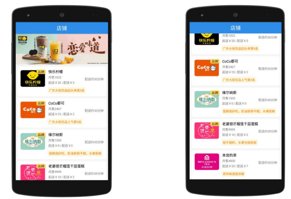
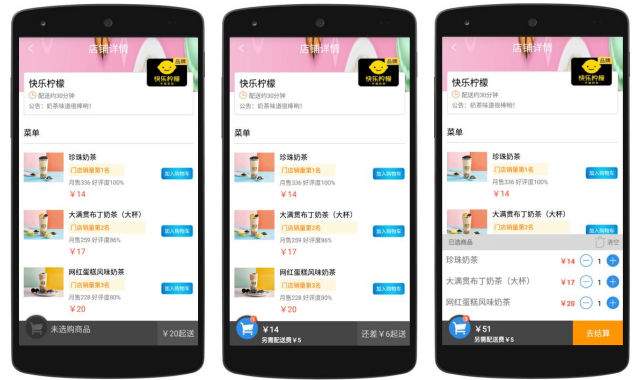
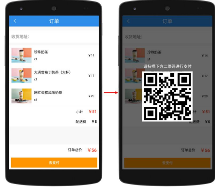

# gdut-android

## 1. 开发环境

|                       | 本项目使用版本     |
| :-------------------- | :----------------- |
| JDK                   | jdk-11.0.11        |
| SDK                   | 32（minSdk 23/21） |
| Gradle                | gradle-7.4-bin     |
| Android Gradle Plugin | 7.3.0              |

## 2. 订餐项目启动

### project-order

> Tomcat 中 order 资源文件：`project-order/tomcat9/webapps/ROOT/order`

Tomcat 启动：

```
project-order/tomcat9/bin/startup.bat
```

修改内网接口：

```java
package com.wangning.order.utils;

public class Constant {
    /**
     * 内网接口
     * <p>
     * TODO: 修改 IP:PORT
     */
    public static final String WEB_SITE = "http://xxx.xxx.xxx.xxx:8080/order";

    /**
     * 店铺列表接口
     */
    public static final String REQUEST_SHOP_URL = "/shop_list_data.json";
}
```

Android 启动：

```
project-order/Order/app/src/main/java/com/wangning/order/SplashActivity.java
```

### PPT

源文件：[Android移动开发基础案例教程（第2版）-PPT及源代码](https://github.com/jiong952/Android_Book_Code) 中的 Chapter12 + Tomcat 服务器

> Tomcat 中 order 资源文件：`project-itcast-order/apache-tomcat-8.5.59/webapps/ROOT/order`

修改内网接口：

```java
// Tomcat 默认端口 8080，ipconfig 查看本地ip
// http://IP:PORT/order

package cn.itcast.order.utils;
public class Constant {
    public static final String WEB_SITE = "http://xxx.xxx.xxx.xxx:8080/order";//内网接口
    public static final String REQUEST_SHOP_URL = "/shop_list_data.json";  //店铺列表接口
}

// 在 project-itcast-order/apache-tomcat-8.5.59/webapps/ROOT/order/shop_list_data.json 中
// 全文替换 http://172.16.43.20:8080/ | http://192.168.3.185:8080/ 为 http://xxx.xxx.xxx.xxx:8080/
```

* [Android P新特性](https://www.jianshu.com/p/3600483f9c9f)（这个设置不用第三方模拟器，直接在 Android Studio 中的手机虚拟机运行）

```xml
<!-- project-order/Order/app/src/main/res/xml/network_security_config.xml -->
<network-security-config>
    <!-- 默认运行所有网址使用非安全连接 -->
    <base-config cleartextTrafficPermitted="true" />
</network-security-config>

<!-- AndroidManifest.xml -->
……
<application>
……
    android:networkSecurityConfig="@xml/network_security_config"
……
</application>
```

Tomcat 启动：

```
project-itcast-order/apache-tomcat-8.5.59/bin/startup.bat
```

Android 启动：

```
project-itcast-order/Order/app/src/main/java/cn/itcast/order/activity/ShopActivity.java
```

## 3. Reference

**Android 课程资料**

* [Android移动开发基础案例教程（第2版）-PPT及源代码](https://github.com/jiong952/Android_Book_Code)
* [第一行代码 Android 第2版 (郭霖) .pdf](./第一行代码 Android 第2版 (郭霖) .pdf) + [《第一行代码 第2版》全书源代码](https://github.com/guolindev/booksource)
* [https://developer.android.google.cn/](https://developer.android.google.cn/docs?hl=zh-cn)

**依赖库**

* [LitePal](https://github.com/guolindev/LitePal)
* [okhttp](https://square.github.io/okhttp/)

* [glide](https://muyangmin.github.io/glide-docs-cn/)
* [gson](https://github.com/google/gson)

**第三方组件库**

* [Banner 轮播控件](https://github.com/youth5201314/banner)
* [XUI](https://github.com/xuexiangjys/XUI)
* [QMUI_Android](https://github.com/Tencent/QMUI_Android)

**订餐项目参考**

* [Android移动开发基础案例教程（第2版）Chapter12](https://github.com/jiong952/Android_Book_Code)

* [Android studio实现网上订餐app](https://blog.csdn.net/H_beallyoucanbe/article/details/122096957)
* [cumt_order](https://github.com/JunyaoHu/cumt_order)
* [android项目实战-订餐项目](https://www.bilibili.com/video/BV1Hv411z79k)（应该是第1版书的代码，没有轮播图？）
* [Android订餐项目期末大作业（简介附源码 主题为明日方舟，含大量ooc制作）](https://www.bilibili.com/video/BV1rf4y1C7cn)

**杂**

* [更改Android Studio中AVD的默认路径](https://blog.csdn.net/qq_45458915/article/details/113914691)
* [Android P新特性](https://www.jianshu.com/p/3600483f9c9f)（这个设置不用第三方模拟器，直接在 Android Studio 中的手机虚拟机运行）

## 4. 实验+大作业

### 实验一

**实验a UserLogin**

编写一个用户登录界面（类似QQ），界面中必须要有文本提示信息（TextView），编辑框（EditText），按钮（Button），分别用于显示“计算机学院20级学生”、“口令”，输入用户名、密码，登录、报错等功能。

**实验b ShoppingMall**

参考第三章《购物商城》，在界面显示8个商品图像与价格提交内容。


**实验c ActivityLifeCycle**

Activity生命周期：在Activity中重载下图中9种事件函数，在调用不同函数时使用LogCat在控制台中输出调用日志。掌握Activity在启动、停止和销毁等不同阶段，9种重载函数的调用顺序，并掌握Android调试工具LogCat的使用方法。报告可以引入图片展示各个事件的进展。


**实验d PickPeach**

Activity生命周期案例：参考第四章《猴子摘桃》，进行相应改编，比如更换背景图片，按钮图片等。体验Activity的创建、Activity的生命周期、数据传递。LogCat观察并用截图表示。


---

### 实验二

**实验a GDUT_CS**

参考第四章《美团菜单》案例，实现广东工业大学计算机学院简介。Fragment共4个Tab：光荣历程；师资力量；莘莘学子；学院活动。文字内容自选，不能雷同。背景配合不同场景的照片。


**实验b DataTransmission**

设计一个主Activity和一个子Activity（Sub-Activity），使用主Activity上的按钮启动子Activity，并将子Activity的一些信息返回给主Activity，并显示在主Activity（可以自己设计界面和场景）。主Activity界面上有一个“登录”按钮和一个用了显示信息的TextView，点击“登录”按钮后打开一个新的Activity，新Activity上面有输入用户名和密码的控件，在用户关闭这个Activity后，将用户输入的用户名和密码传递到主Activity，并显示在主Activity的TextView中。

**实验c Directory**

数据存储：参考第五章《通讯录》，进行相应改编，比如更换背景图片，按钮图片等。采用文件存储、SharedPreferences、SQLite三种方式存储用户信息，并实现增删查改功能。

---

### 实验三

**实验a OrderedBroadcast**

模仿第七章拦截有序广播案例，3个广播接收者，优先权最高的接收广播后，打开新页面，展示背景图和一个文本框，自定义内容。

**实验b MusicPlayer**

模仿第八章的案例MusicPlayer实现音乐播放器。

1. 更换背景图片与音频资料（自选）。
2. 增加音乐选择、切换按钮，实现切换歌曲功能。
3. 通过LogCat记录服务的生命周期。
4. 采用Handler机制传递服务消息。

**实验c StuInfo**

参考第5章中案例（SQLite、ListView、BaseAdapter），录入数据库（8组信息）字段：姓名，成绩；头像（考虑到有一定难度可以另外输入设置）。录入数据库后，设置展示按钮（Let me see!），转入下一页ListView方式展示头像、姓名、成绩。

**实验d WebView**

参考第9章WebView案例，使用WebView控件分别加载HTML代码与JavaScript代码的网页。

---

### 大作业

#### 制作《仿美团外卖》APP

1. 程序启动后，首先会进入店铺界面，该界面展示的是一些由店铺信息组成的列表与一个滑动的广告栏。



2. 点击店铺列表中任意一个条目或广告栏中的任意一张图片，程序都会跳转到对应的店铺详情界面，该界面展示的是店铺的公告信息、配送信息、菜单列表信息以及购物车信息。点击菜单列表条目右侧的“加入购物车”按钮可以将菜品添加到购物车中，在界面左下角可以看到购物车中添加的菜品数量。



3. 已选商品列表的右上角有一个“清空”按钮，点击该按钮会弹出一个确认清空购物车的对话框。


4. 在店铺详情界面中，点击菜单列表的任意一个条目，程序都会跳转到菜品详情界面，菜品详情界面是一个对话框的样式。


5. 在店铺详情界面中，点击“去结算”按钮会跳转到订单界面，该界面通过一个列表展示购物车中的菜品信息，点击“去支付”按钮，程序会弹出一个显示支付二维码的对话框。

